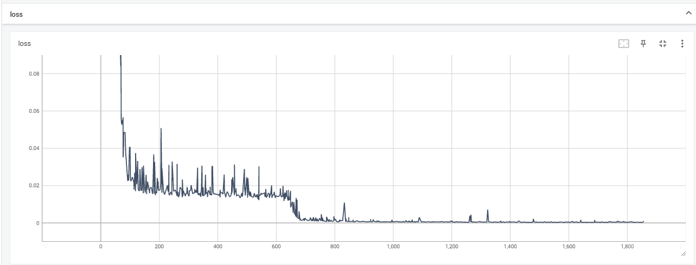

# LlaMA3-SFT
LlaMA3-SFT, Meta-Llama-3-8B/Meta-Llama-3-8B-Instruct微调(transformers)/LORA(peft)/推理

## 项目地址
 - [https://github.com/yongzhuo/LLaMA3-SFT](https://github.com/yongzhuo/LLaMA3-SFT)
 - 默认数据类型为bfloat6

## 备注
```python
1. 非常重要: weights要用bfloat16/fp32/tf32(第二版大模型基本共识), 不要用fp16, fp16会特别容易loss=NAN;
2. SFT最好还是像预训练那样, input/output都计算loss;
2. transformers需要4.40.0及以上;
3. llama3, 模型的词典大小为128256, 使用tiktoken;
4. llama3网络架构同Llama2, 使用GQA/MQA等加速; 
5. prompt:
   5.1 标准格式为: 
text_input + text_output
   5.2 prompt格式为: 
<|begin_of_text|><|start_header_id|>system<|end_header_id|>

{system_prompt}<|eot_id|><|start_header_id|>user<|end_header_id|>

{text_input}<|eot_id|><|start_header_id|>assistant<|end_header_id|>

{text_output}<|eot_id|>
6 微调输入输出:
    输入："<|begin_of_text|><|start_header_id|>system<|end_header_id|>\n\n{system_prompt}<|eot_id|><|start_header_id|>user<|end_header_id|>\n\n{text_input}<|eot_id|>"
    输出："<|start_header_id|>assistant<|end_header_id|>\n\n{text_output}<|eot_id|>"
7 推理输入输出(assistant\n放置位置不同):
    输入："<|begin_of_text|><|start_header_id|>system<|end_header_id|>\n\n{system_prompt}<|eot_id|><|start_header_id|>user<|end_header_id|>\n\n{text_input}<|eot_id|><|start_header_id|>assistant<|end_header_id|>\n\n"
    输出："{text_output}<|eot_id|>"
8. 网络各层名称
('base_model.model.model.embed_tokens.weight', torch.bfloat16, False)
......
('base_model.model.model.layers.31.self_attn.q_proj.weight', torch.bfloat16, False)
('base_model.model.model.layers.31.self_attn.k_proj.weight', torch.bfloat16, False)
('base_model.model.model.layers.31.self_attn.v_proj.weight', torch.bfloat16, False)
('base_model.model.model.layers.31.self_attn.o_proj.weight', torch.bfloat16, False)
('base_model.model.model.layers.31.mlp.gate_proj.weight', torch.bfloat16, False)
('base_model.model.model.layers.31.mlp.up_proj.weight', torch.bfloat16, False)
('base_model.model.model.layers.31.mlp.down_proj.weight', torch.bfloat16, False)
('base_model.model.model.layers.31.input_layernorm.weight', torch.bfloat16, False)
('base_model.model.model.layers.31.post_attention_layernorm.weight', torch.bfloat16, False)
('base_model.model.model.norm.weight', torch.bfloat16, False)
('base_model.model.lm_head.weight', torch.bfloat16, False)

9. RuntimeError: unscale_() has already been called on this optimizer since the last update().
    微调语料太少导致的
```

## 环境配置
```shell
transformers>=4.44.0
torch>=1.13.0
safetensors>=0.4.1
accelerate==0.27.1
fsspec==2023.9.2
rouge==1.0.1
nltk==3.6.6
peft>=0.2.0
tiktoken
numpy
tqdm
```

## 微调
```shell
地址: llama3_sft/ft_llama3

配置: llama3_sft/ft_llama3/config.py
训练: python train.py
推理: python predict.py
验证: python evaluation.py
接口: python post_api.py
```

## 数据集-中文
 - [https://huggingface.co/datasets/JosephusCheung/GuanacoDataset](https://huggingface.co/datasets/JosephusCheung/GuanacoDataset)
 - [https://huggingface.co/datasets/shareAI/shareGPT_cn](https://huggingface.co/datasets/shareAI/shareGPT_cn)
 - [https://huggingface.co/datasets/Mutonix/RefGPT-Fact](https://huggingface.co/datasets/Mutonix/RefGPT-Fact)
 - [https://huggingface.co/datasets/BAAI/COIG](https://huggingface.co/datasets/BAAI/COIG)
 - [https://github.com/Instruction-Tuning-with-GPT-4/GPT-4-LLM](https://github.com/Instruction-Tuning-with-GPT-4/GPT-4-LLM)
 - [https://github.com/carbonz0/alpaca-chinese-dataset](https://github.com/carbonz0/alpaca-chinese-dataset)
 - [https://github.com/LianjiaTech/BELLE](https://github.com/LianjiaTech/BELLE)
 - [https://github.com/PhoebusSi/Alpaca-CoT](https://github.com/PhoebusSi/Alpaca-CoT)
 - [https://github.com/Hello-SimpleAI/chatgpt-comparison-detection](https://github.com/Hello-SimpleAI/chatgpt-comparison-detection)
 - [https://github.com/yangjianxin1/Firefly](https://github.com/yangjianxin1/Firefly)
 - [https://github.com/XueFuzhao/InstructionWild](https://github.com/XueFuzhao/InstructionWild)
 - [https://github.com/OpenLMLab/MOSS](https://github.com/OpenLMLab/MOSS)
 - [https://github.com/thu-coai/Safety-Prompts](https://github.com/thu-coai/Safety-Prompts)
 - [https://github.com/LAION-AI/Open-Assistant](https://github.com/LAION-AI/Open-Assistant)
 - [https://github.com/TigerResearch/TigerBot](https://github.com/TigerResearch/TigerBot)


## 参考/感谢
 - [https://github.com/meta-llama/llama3](https://github.com/meta-llama/llama3)
 - [https://github.com/QwenLM/Qwen1.5](https://github.com/QwenLM/Qwen1.5)
 - [https://github.com/google/gemma_pytorch](https://github.com/google/gemma_pytorch)
 - [https://huggingface.co/google/gemma-2b-it](https://huggingface.co/google/gemma-2b-it)
 - [https://huggingface.co/spaces/HuggingFaceH4/open_llm_leaderboard](https://huggingface.co/spaces/HuggingFaceH4/open_llm_leaderboard)
 - [https://github.com/THUDM/ChatGLM-6B](https://github.com/THUDM/ChatGLM-6B)
 - [https://github.com/THUDM/GLM](https://github.com/THUDM/GLM)
 - [https://github.com/tatsu-lab/stanford_alpaca](https://github.com/tatsu-lab/stanford_alpaca)
 - [https://github.com/LianjiaTech/BELLE](https://github.com/LianjiaTech/BELLE)
 - [https://github.com/huggingface/peft](https://github.com/huggingface/peft)
 - [https://github.com/mymusise/ChatGLM-Tuning](https://github.com/mymusise/ChatGLM-Tuning)
 - [https://github.com/bojone/bert4keras](https://github.com/bojone/bert4keras)
 - [trl](https://github.com/lvwerra/trl)
 - [math23k](https://aclanthology.org/D17-1088)


## 微调日志-advgen
### 默认的bf16微调, 计算全部loss(同pt, input/output), loss太低
 


## 推理日志-advgen(SFT), 感觉学到了一些东西, 又没有学会
```cpu
('base_model.model.base_model.model.model.layers.31.self_attn.q_proj.weight', torch.bfloat16, False, tensor([[ 0.0078, -0.0035,  0.0075,  ..., -0.0007, -0.0016, -0.0020],
        [ 0.0036, -0.0019,  0.0140,  ..., -0.0161, -0.0037,  0.0012],
        [ 0.0080,  0.0125, -0.0103,  ..., -0.0005, -0.0267,  0.0027],
        ...,
        [-0.0061,  0.0166,  0.0148,  ..., -0.0105, -0.0165,  0.0242],
        [-0.0181, -0.0244,  0.0100,  ..., -0.0334,  0.0020, -0.0227],
        [-0.0042, -0.0181,  0.0114,  ...,  0.0027, -0.0004, -0.0002]],
       dtype=torch.bfloat16))
('base_model.model.base_model.model.model.layers.31.self_attn.q_proj.lora_A.default.weight', torch.float32, False, tensor([[-0.0188,  0.0052, -0.0048,  ..., -0.0073,  0.0091,  0.0070],
        [-0.0117, -0.0048, -0.0020,  ...,  0.0009,  0.0169,  0.0139],
        [ 0.0011, -0.0023, -0.0166,  ..., -0.0071, -0.0082,  0.0082],
        ...,
        [ 0.0127, -0.0045, -0.0137,  ..., -0.0146,  0.0114, -0.0145],
        [ 0.0038, -0.0148,  0.0001,  ..., -0.0172, -0.0139,  0.0062],
        [-0.0056,  0.0132,  0.0115,  ...,  0.0100,  0.0127,  0.0004]]))
('base_model.model.base_model.model.model.layers.31.self_attn.q_proj.lora_B.default.weight', torch.float32, False, tensor([[ 6.0165e-04, -1.8864e-04,  5.4384e-04,  ...,  3.9676e-04,
         -1.9826e-04, -7.4172e-05],
        [ 2.4563e-03, -2.3599e-03,  2.0984e-03,  ...,  1.9662e-03,
          1.5514e-03, -1.8005e-03],
        [-4.9125e-03,  4.7831e-03, -4.6263e-03,  ..., -4.3837e-03,
         -3.4190e-03,  4.2660e-03],
        ...,
        [ 1.2281e-05,  5.1583e-04, -1.4735e-04,  ...,  1.3617e-04,
         -9.5673e-04,  8.3033e-04],
        [-1.5139e-03,  3.0022e-03, -2.4098e-03,  ..., -1.9860e-03,
         -2.3010e-03,  2.5711e-03],
        [ 1.6433e-03, -2.0675e-03,  2.2618e-03,  ...,  1.4840e-03,
          1.1958e-03, -1.3300e-03]]))
('base_model.model.base_model.model.model.layers.31.self_attn.k_proj.weight', torch.bfloat16, False, tensor([[ 0.0126, -0.0269,  0.0297,  ...,  0.0481, -0.0057,  0.0061],
        [-0.0262, -0.0154, -0.0427,  ..., -0.0217, -0.0513,  0.0092],
        [ 0.0098,  0.0058,  0.0157,  ..., -0.0054, -0.0025, -0.0024],
        ...,
        [-0.0198,  0.0408, -0.0136,  ..., -0.0173, -0.0432,  0.0082],
        [ 0.0312,  0.0239,  0.0247,  ..., -0.0171, -0.0284, -0.0432],
        [-0.0096,  0.0043,  0.0142,  ..., -0.0164, -0.0386,  0.0206]],
       dtype=torch.bfloat16))
('base_model.model.base_model.model.model.layers.31.self_attn.k_proj.lora_A.default.weight', torch.float32, False, tensor([[ 0.0137, -0.0115,  0.0137,  ..., -0.0069, -0.0056, -0.0032],
        [-0.0117, -0.0096, -0.0165,  ..., -0.0014,  0.0045, -0.0028],
        [ 0.0072, -0.0115,  0.0109,  ..., -0.0169, -0.0165,  0.0081],
        ...,
        [-0.0194,  0.0073, -0.0093,  ...,  0.0050, -0.0120,  0.0028],
        [-0.0064, -0.0142, -0.0112,  ..., -0.0126,  0.0087,  0.0097],
        [-0.0108,  0.0042, -0.0046,  ...,  0.0105, -0.0111, -0.0107]]))
('base_model.model.base_model.model.model.layers.31.self_attn.k_proj.lora_B.default.weight', torch.float32, False, tensor([[ 0.0024, -0.0033, -0.0026,  ..., -0.0024, -0.0035, -0.0017],
        [ 0.0016, -0.0022, -0.0032,  ..., -0.0017, -0.0023,  0.0015],
        [-0.0028,  0.0032,  0.0029,  ...,  0.0027,  0.0034,  0.0017],
        ...,
        [-0.0015, -0.0001,  0.0005,  ...,  0.0001,  0.0006, -0.0047],
        [ 0.0022,  0.0023, -0.0005,  ..., -0.0007, -0.0013,  0.0028],
        [-0.0003, -0.0020, -0.0002,  ..., -0.0003, -0.0003, -0.0021]]))
('base_model.model.base_model.model.model.layers.31.self_attn.v_proj.weight', torch.bfloat16, False, tensor([[ 0.0172,  0.0181, -0.0032,  ..., -0.0250, -0.0186,  0.0119],
        [-0.0042,  0.0047, -0.0134,  ..., -0.0077,  0.0078, -0.0031],
        [-0.0422, -0.0249, -0.0136,  ..., -0.0295,  0.0302, -0.0123],
        ...,
        [ 0.0076, -0.0002, -0.0001,  ...,  0.0093, -0.0047, -0.0044],
        [-0.0014, -0.0033, -0.0076,  ..., -0.0109, -0.0012, -0.0215],
        [-0.0232,  0.0025,  0.0060,  ...,  0.0068, -0.0093, -0.0073]],
       dtype=torch.bfloat16))
('base_model.model.base_model.model.model.layers.31.self_attn.v_proj.lora_A.default.weight', torch.float32, False, tensor([[ 0.0090,  0.0004, -0.0076,  ...,  0.0153,  0.0041, -0.0103],
        [ 0.0138,  0.0015, -0.0053,  ..., -0.0128,  0.0011, -0.0022],
        [-0.0111, -0.0032,  0.0006,  ..., -0.0077,  0.0128,  0.0151],
        ...,
        [-0.0029,  0.0131,  0.0163,  ..., -0.0044, -0.0083, -0.0115],
        [ 0.0041,  0.0133,  0.0181,  ...,  0.0027,  0.0083,  0.0050],
        [ 0.0024, -0.0063,  0.0042,  ..., -0.0021, -0.0047,  0.0007]]))
('base_model.model.base_model.model.model.layers.31.self_attn.v_proj.lora_B.default.weight', torch.float32, False, tensor([[-3.0396e-04, -1.8482e-04, -4.5843e-04,  ..., -7.0217e-05,
         -7.8356e-04, -3.6097e-04],
        [-6.1859e-04, -1.8265e-04,  3.9717e-04,  ..., -1.0677e-03,
         -1.9114e-03, -1.1090e-03],
        [-3.2717e-04,  5.8097e-04,  2.8924e-04,  ...,  2.1774e-04,
          2.1301e-04, -4.1886e-04],
        ...,
        [-1.9359e-03, -1.4303e-03, -1.5492e-03,  ..., -1.3788e-03,
         -1.8295e-03, -2.1401e-03],
        [-6.3756e-04, -5.9278e-04, -4.7388e-04,  ..., -4.0911e-04,
         -2.1048e-04, -5.5398e-04],
        [-1.9948e-03, -2.3558e-03, -2.5491e-03,  ..., -1.5711e-03,
         -1.9010e-03, -2.4418e-03]]))
('base_model.model.base_model.model.model.layers.31.self_attn.o_proj.weight', torch.bfloat16, False, tensor([[ 0.0198, -0.0121, -0.0223,  ...,  0.0117, -0.0031,  0.0131],
        [ 0.0003, -0.0032, -0.0046,  ...,  0.0013, -0.0013,  0.0123],
        [-0.0073,  0.0129, -0.0085,  ..., -0.0016,  0.0074, -0.0052],
        ...,
        [ 0.0015,  0.0116, -0.0047,  ..., -0.0004, -0.0016,  0.0125],
        [-0.0167,  0.0030,  0.0166,  ..., -0.0014, -0.0126,  0.0087],
        [ 0.0172, -0.0017,  0.0156,  ..., -0.0197,  0.0104, -0.0012]],
       dtype=torch.bfloat16))
('base_model.model.base_model.model.model.layers.31.mlp.gate_proj.weight', torch.bfloat16, False, tensor([[-0.0142,  0.0153, -0.0243,  ...,  0.0134,  0.0041,  0.0069],
        [-0.0006,  0.0083,  0.0076,  ...,  0.0160,  0.0080,  0.0121],
        [-0.0128,  0.0200, -0.0142,  ...,  0.0060, -0.0074, -0.0006],
        ...,
        [ 0.0054, -0.0041,  0.0251,  ...,  0.0022,  0.0177,  0.0177],
        [-0.0178, -0.0178,  0.0045,  ...,  0.0131, -0.0084, -0.0108],
        [-0.0269, -0.0266, -0.0234,  ...,  0.0366,  0.0393,  0.0086]],
       dtype=torch.bfloat16))
('base_model.model.base_model.model.model.layers.31.mlp.up_proj.weight', torch.bfloat16, False, tensor([[-1.6357e-02, -2.5513e-02, -6.4087e-03,  ...,  1.8555e-02,
         -7.5684e-03,  9.8877e-03],
        [ 6.4697e-03,  1.2436e-03,  1.2390e-02,  ...,  7.2937e-03,
          3.4668e-02, -3.9673e-03],
        [ 4.4556e-03,  2.2583e-03,  5.8594e-03,  ..., -8.6060e-03,
          1.4465e-02, -2.1484e-02],
        ...,
        [ 2.5757e-02,  1.9836e-03,  1.8677e-02,  ...,  5.1880e-03,
          1.0864e-02,  9.9659e-05],
        [-3.5400e-03,  1.4221e-02, -8.6060e-03,  ...,  6.6833e-03,
          1.0071e-03,  1.2512e-02],
        [ 9.5825e-03, -1.3489e-02, -1.3885e-03,  ..., -4.4861e-03,
         -3.0823e-03, -9.3384e-03]], dtype=torch.bfloat16))
('base_model.model.base_model.model.model.layers.31.mlp.down_proj.weight', torch.bfloat16, False, tensor([[-0.0334,  0.0152,  0.0194,  ...,  0.0025,  0.0114,  0.0013],
        [-0.0050, -0.0064,  0.0026,  ..., -0.0042,  0.0032, -0.0086],
        [-0.0094, -0.0220, -0.0214,  ...,  0.0029, -0.0057, -0.0084],
        ...,
        [ 0.0125,  0.0017, -0.0042,  ..., -0.0166, -0.0077,  0.0110],
        [-0.0128,  0.0073,  0.0140,  ..., -0.0193,  0.0125,  0.0109],
        [-0.0074, -0.0139,  0.0104,  ...,  0.0105,  0.0035,  0.0027]],
       dtype=torch.bfloat16))
('base_model.model.base_model.model.model.layers.31.input_layernorm.weight', torch.bfloat16, False, tensor([0.4629, 0.3984, 0.4434,  ..., 0.4277, 0.3887, 0.2988],
       dtype=torch.bfloat16))
('base_model.model.base_model.model.model.layers.31.post_attention_layernorm.weight', torch.bfloat16, False, tensor([0.5273, 0.4883, 0.5078,  ..., 0.5273, 0.4863, 0.4238],
       dtype=torch.bfloat16))
('base_model.model.base_model.model.model.norm.weight', torch.bfloat16, False, tensor([2.6562, 2.5781, 2.6094,  ..., 2.5938, 2.2656, 2.5156],
       dtype=torch.bfloat16))
('base_model.model.base_model.model.lm_head.weight', torch.bfloat16, False, tensor([[ 9.8267e-03,  1.7456e-02,  3.6926e-03,  ...,  5.7983e-04,
         -1.6968e-02, -1.0986e-02],
        [-6.5613e-03,  1.1719e-02,  1.1536e-02,  ..., -1.0193e-02,
          9.3994e-03, -1.4496e-03],
        [ 1.4160e-02,  9.4604e-03,  7.4463e-03,  ..., -1.9379e-03,
         -5.7678e-03, -1.4771e-02],
        ...,
        [-3.7231e-03, -1.3065e-04,  7.5684e-03,  ...,  9.6798e-05,
          7.5989e-03,  6.0425e-03],
        [-3.7231e-03, -1.3065e-04,  7.5684e-03,  ...,  9.6798e-05,
          7.5989e-03,  6.0425e-03],
        [-3.7231e-03, -1.3065e-04,  7.5684e-03,  ...,  9.6798e-05,
          7.5989e-03,  6.0425e-03]], dtype=torch.bfloat16))
trainable params: 0 || all params: 8039698432 || trainable%: 0.0
Special tokens have been added in the vocabulary, make sure the associated word embeddings are fine-tuned or trained.
128009
128000
128009
198
882
78191
{'content': '类型#裙*版型#宽松*版型#显瘦*颜色#黑色*图案#撞色*裙型#直筒裙*裙款式#拼接'}
tensor([[128000, 128006,   9125, 128007,    271,   2675,    527,    264,  11190,
          18328,     11,    220,  15225,  11883,  99337,  33014, 108891, 113925,
             13, 128009, 128006,    882, 128007,    271,  33005,      2,  70892,
            247,      9,  41401,  25287,      2, 118188, 104500,      9,  41401,
          25287,      2, 105593, 114431,     99,      9, 124510,  39135,      2,
          57752,  39135,      9,  29129,  81742,      2,  58843,    252,  39135,
              9,  70892,    247,  25287,      2,  74245, 127946,  70892,    247,
              9,  70892,    247,  69253,  29430,      2, 125973,  30177, 128009,
         128006,  78191, 128007,    271]])
<|begin_of_text|><|start_header_id|>system<|end_header_id|>

You are a helpful assistant, 请用简体中文回答.<|eot_id|><|start_header_id|>user<|end_header_id|>

类型#裙*版型#宽松*版型#显瘦*颜色#黑色*图案#撞色*裙型#直筒裙*裙款式#拼接<|eot_id|><|start_header_id|>assistant<|end_header_id|>

根据你的描述，这是一件黑色撞色拼接直筒裙，裙型宽松，版型显瘦，裙款式拼接。<|eot_id|>

617.0838704109192
请输入:
类型#裤*材质#牛仔布*颜色#白色*风格#简约*图案#线条*裤长#短裤*裤型#阔腿裤*裤腰型#高腰*裤口#毛边
请稍等...
################################################################################################################################
{'content': '类型#裤*材质#牛仔布*颜色#白色*风格#简约*图案#线条*裤长#短裤*裤型#阔腿裤*裤腰型#高腰*裤口#毛边'}
tensor([[128000, 128006,   9125, 128007,    271,   2675,    527,    264,  11190,
          18328,     11,    220,  15225,  11883,  99337,  33014, 108891, 113925,
             13, 128009, 128006,    882, 128007,    271,  33005,      2,  70892,
             97,      9, 103234, 103706,      2, 109022, 120248,  52927,      9,
         124510,  39135,      2, 101828,  39135,      9, 103125,  35083,      2,
          99337,  95337,      9,  29129,  81742,      2,  44368,  40089,      9,
          70892,     97,  46961,      2, 106649,  70892,     97,      9,  70892,
             97,  25287,      2,  33443,    242, 122072,  70892,     97,      9,
          70892,     97, 115519,  25287,      2,  45736, 115519,      9,  70892,
             97,  40526,      2, 105811, 103377, 128009, 128006,  78191, 128007,
            271]])
<|begin_of_text|><|start_header_id|>system<|end_header_id|>

You are a helpful assistant, 请用简体中文回答.<|eot_id|><|start_header_id|>user<|end_header_id|>

类型#裤*材质#牛仔布*颜色#白色*风格#简约*图案#线条*裤长#短裤*裤型#阔腿裤*裤腰型#高腰*裤口#毛边<|eot_id|><|start_header_id|>assistant<|end_header_id|>

根据您的描述，这是一双简约的短裤，使用牛仔布，白色为主色，线条图案，阔腿裤型，高腰，毛边裤口。<|eot_id|>

```

## 推理日志-advgen(SFT), 修改prompt微调, 指令遵循得不是太好, 感觉还是中文预训练语料太少了吧
```
<|begin_of_text|><|start_header_id|>system<|end_header_id|>

You are a helpful assistant, 请根据输入生成创意广告, 用简体中文回答.<|eot_id|><|start_header_id|>user<|end_header_id|>

类型#裙*版型#宽松*版型#显瘦*颜色#黑色*图案#撞色*裙型#直筒裙*裙款式#拼接<|eot_id|><|start_header_id|>assistant<|end_header_id|>

Here's a creative advertisement based on your input:

**Headline:** 撞色撞焦点！黑色撞色拼接直筒裙

**Body:**

你准备好撞焦点了吗？我们的黑色撞色拼接直筒裙将让你在人群中脱颖而出！

宽松版型，显瘦效果，让你显得更加苗条迷人。撞色图案，黑色拼接，更加增加裙子的时尚感和吸引力。

这不是一件裙子，而是一件生活方式。穿上我们的黑色撞色拼接直筒裙，你将成为焦点，吸引所有人的目光。

**Call to Action:** 快来试穿我们的黑色撞色拼接直筒裙，体验一下撞焦点的感觉！

**Visuals:** A stunning image of a model wearing the black and color-blocked straight-cut skirt, posing confidently with a bold expression. The skirt is designed to accentuate her curves, and the color-blocked pattern adds a touch of edginess to the overall look. The background is a dark, sleek cityscape, emphasizing the
###################################################################
<|begin_of_text|><|start_header_id|>system<|end_header_id|>

You are a helpful assistant, 请根据输入生成创意广告, 用简体中文回答.<|eot_id|><|start_header_id|>user<|end_header_id|>

类型#裤*材质#牛仔布*颜色#白色*风格#简约*图案#线条*裤长#短裤*裤型#阔腿裤*裤腰型<|eot_id|><|start_header_id|>assistant<|end_header_id|>

Here's a creative ad for the specified type of pants:

**Title:** 时尚简约，阔腿裤，白色牛仔布短裤

**Image:** A stylish photo of a person wearing the white cowboy-style short pants with a simple and minimalist design. The pants have a wide leg and a high waist, with a subtle stitching pattern along the seams.

**Headline:** 简约 yet 时尚，阔腿裤白色牛仔布短裤，让你展现自己的个性！

**Body:** 不需要很多花哨的设计，阔腿裤白色牛仔布短裤就足以让你展现自己的个性！这款简约的短裤，以牛仔布为材料，白色为主色调，线条简洁，给人一种简洁 yet 时尚的感觉。无论是街头、工作或休闲，这款短裤都能满足你的需求，让你展现自己的个性！

**Call-to-Action:** 快来抢购这款简约 yet 时尚的短裤，展现自己的个性！

**Target Audience:** Young adults who value simplicity and individuality
################################################################################
<|begin_of_text|><|start_header_id|>system<|end_header_id|>

You are a helpful assistant, 请根据输入生成创意广告, 用简体中文回答.<|eot_id|><|start_header_id|>user<|end_header_id|>

类型#裤*材质#牛仔布*颜色#白色*风格#简约*图案#线条*裤长#短裤*裤型#阔腿裤*裤腰型#高腰*裤口#毛边<|eot_id|><|start_header_id|>assistant<|end_header_id|>

Here's a creative advertisement for the product:

**Title:** 升级你的夏日风采！【简约牛仔短裤】

**Image:** A stylish model wearing the white cowhide short pants with a high waist and wide legs, posing in a casual yet chic way. The pants have a subtle texture and a raw edge hem, adding a touch of edginess to the overall look.

**Headline:** 升级你的夏日风采！简单 yet chic，简约牛仔短裤让你夏日更加精彩！

**Body Text:** 夏日到了，时尚也到了！简约牛仔短裤是夏日的必备！高腰设计，阔腿裤造型，毛边裤口，简约牛仔短裤让你夏日更加精彩！不仅舒适还非常时尚，简约牛仔短裤是你的夏日必备！

**Call-to-Action:** 快来获取你的简约牛仔短裤，升级你的夏日风采！

This advertisement highlights the key features of the product, such as the high waist, wide legs, and raw edge hem, while also emphasizing its comfort and stylishness
```


## 推理日志-advgen(原始Instruct)
```
<|begin_of_text|><|start_header_id|>system<|end_header_id|>

You are a helpful assistant, 请用简体中文回答.<|eot_id|><|start_header_id|>user<|end_header_id|>

类型#裙*材质#天丝*裙长#连衣裙*裙袖长#长袖<|eot_id|><|start_header_id|>assistant<|end_header_id|>

Based on your input, I understand that you are looking for information about a dress with the following specifications:

* Type: 连衣裙 (a-line dress)
* Material: 天丝 (silk)
* Length: 不指定 (no specific length mentioned, but since it's a 连衣裙, it's likely to be knee-length or longer)
* Sleeve length: 长袖 (long sleeves)

Here's a summary of your requirements:

* A-line dress made of silk with long sleeves and a knee-length or longer hem.

If you have any further questions or would like to know more about this type of dress, feel free to ask! 😊<|eot_id|>
#############################################################
<|begin_of_text|><|start_header_id|>system<|end_header_id|>

You are a helpful assistant, 请用简体中文回答.<|eot_id|><|start_header_id|>user<|end_header_id|>

类型#裙*版型#宽松*版型#显瘦*颜色#黑色*图案#撞色*裙型#直筒裙*裙款式#拼接<|eot_id|><|start_header_id|>assistant<|end_header_id|>

Based on your input, I can help you with the following information:

* 类型：裙 (type: skirt)
* 版型：宽松 (style: loose-fitting)
* 版型：显瘦 (style: slimming)
* 颜色：黑色 (color: black)
* 图案：撞色 (pattern: contrast color)
* 裙型：直筒裙 (skirt type: straight skirt)
* 裙款式：拼接 (skirt style: patchwork)

So, the overall description is: a black straight skirt with a loose-fitting and slimming design, featuring a contrast color pattern through patchwork.<|eot_id|>
#############################################################
<|begin_of_text|><|start_header_id|>system<|end_header_id|>

You are a helpful assistant, 请用简体中文回答.<|eot_id|><|start_header_id|>user<|end_header_id|>

类型#裤*材质#牛仔布*颜色#白色*风格#简约*图案#线条*裤长#短裤*裤型#阔腿裤*裤腰型#高腰*裤口#毛边<|eot_id|><|start_header_id|>assistant<|end_header_id|>

您所描述的裤子是：

* 材质：牛仔布（denim）
* 颜色：白色（white）
* 风格：简约（simple）
* 图案：线条（striped）
* 裤长：短裤（short）
* 裤型：阔腿裤（wide-leg）
* 裤腰型：高腰（high-waisted）
* 裤口：毛边（fringed）

总的来说，这是一双简约、白色的牛仔短裤，具有线条图案、阔腿设计和高腰裤口。<|eot_id|>
```


